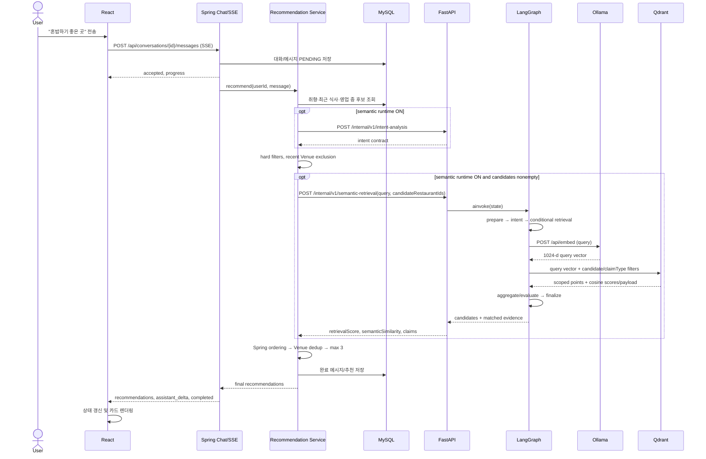

# 프로젝트 학습 1 — 문제와 전체 아키텍처

## 이 프로젝트가 해결하려는 문제

ZeroPay 가맹 여부, 영업 상태, 예산, 최근 식사처럼 틀리면 안 되는 조건을 통과한 음식점 중에서 사용자의 자연어 취향에 맞는 점심 후보를 최대 3곳 추천한다. 범위는 논현동 KOMSCO 음식점 모집단이다. AI가 자격 조건을 판단하는 시스템이 아니라, Spring이 만든 안전한 후보 집합 안에서 의미상 관련 있는 근거를 찾는 구조다.

## 구성요소와 소유권

| 영역 | 이 저장소에서 하는 일 | 주요 진입점 |
|---|---|---|
| React | 로그인된 대화, 입력, SSE 수신, 추천 카드 표시 | `frontend/src/main.tsx`, `App.tsx`, `hooks/useChatStream.ts`, `api/chat.ts` |
| Spring Boot | 공개 API·인증·채팅 영속화, MySQL 기준 데이터, hard filter, 최종 순위·중복 제거 | `backend/src/main/java/com/zeropaylunch/backend/chat/api/ChatController.java`, `backend/src/main/java/com/zeropaylunch/backend/restaurant/application/RestaurantRecommendationService.java` |
| FastAPI | 내부 intent 계약, candidate-scoped retrieval, query embedding/Qdrant, 내부 workflow | `ai/app/main.py`, `ai/app/semantic_runtime.py`, `ai/app/workflows/` |
| MySQL/Flyway | Restaurant, 취향, 식사 이력, 대화 및 추천 저장 | `backend/src/main/resources/db/migration/` 및 JPA/JDBC 코드 |
| Ollama | runtime query embedding; 모델명은 `qwen3-embedding:0.6b` | `ai/app/semantic_embedding_qdrant_pilot.py::embed` |
| Qdrant | 이미 적재된 semantic claim point를 읽기 전용 검색 | `SemanticRetrievalService.retrieve` |
| 오프라인 AI CLI | provider matching, entity resolution, 상세 수집 및 frozen profile 실험 | `ai/app/providers/`, `entity_resolution/`, `canonical/`, `naver/`, `batch/` |
| Docker Compose | MySQL, backend, AI 및 보조 runtime의 연결·환경변수 제공 | `docker-compose.yml`, `.env.example` |
| 검증 스크립트 | AI/backend/frontend/integration/E2E harness 진입점 | `scripts/check-*.sh`, `scripts/check-mvp-e2e.sh` |
| 테스트 | 계약·정책 단위 테스트부터 isolated browser flow까지 | `ai/tests/`, `backend/src/test/`, `frontend/src/**/*.test.*`, `frontend/e2e/` |
| 문서·결과물 | architecture/API/schema 설명과 실험 관측을 보관; 실행 코드를 대체하지 않음 | `docs/`, `AI_Answer/` |

FastAPI가 MySQL에 직접 접근하지 않는다. 브라우저도 FastAPI를 직접 호출하지 않는다. 현재 `AI_SEMANTIC_RUNTIME_ENABLED` 기본값은 `false`이며, OFF면 Spring 내부의 deterministic 경로만 쓴다. Qdrant는 파생 검색 저장소이지 원본 저장소나 최종 추천 소유자가 아니다.

## 파일을 읽는 순서

1. `frontend/src/App.tsx` — 채팅 UI와 `useChatStream` 연결을 본다.
2. `frontend/src/hooks/useChatStream.ts::sendMessage/runStream/handleStreamEvent` — 상태와 SSE 이벤트가 화면에 반영되는 방식을 본다.
3. `frontend/src/api/chat.ts::streamChatMessage` — 실제 URL, 인증 fetch, SSE parsing을 확인한다.
4. `backend/src/main/java/com/zeropaylunch/backend/chat/api/ChatController.java::sendMessage` — 공개 요청과 인증 주체를 본다.
5. `backend/src/main/java/com/zeropaylunch/backend/chat/application/ChatStreamService.java::streamReply/emitReply` — 비동기 SSE와 추천 호출을 본다.
6. `backend/src/main/java/com/zeropaylunch/backend/recommendation/application/RecommendationContextService.java::build` — 취향·최근 식사·intent 입력을 확인한다.
7. `backend/src/main/java/com/zeropaylunch/backend/restaurant/application/RestaurantRecommendationService.java::recommend` — 후보 생성부터 max 3까지 한 번에 따라간다.
8. `backend/src/main/java/com/zeropaylunch/backend/recommendation/ai/FastApiSemanticClient.java`와 `SemanticCandidateEnricher.java` — 내부 HTTP contract와 fallback을 본다.
9. `ai/app/main.py` — 실제 FastAPI route와 graph entry를 확인한다.
10. `ai/app/workflows/recommendation_graph.py`, `recommendation_state.py` — 분기·retry·fallback 상태를 본다.
11. `ai/app/semantic_runtime.py::analyze/retrieve` — intent, embedding, Qdrant query를 따라간다.
12. `ai/app/hybrid_policy.py::_route_v2/_aggregate` — retrieval routing과 점수 구성을 본다.
13. `ai/app/semantic_embedding_qdrant_pilot.py::embed` — 모델과 embedding HTTP 호출을 본다. 이 파일에는 별도의 offline indexing `main()`도 있으니 실행하지 않는다.
14. `ai/tests/test_recommendation_graph.py`, `ai/tests/test_semantic_runtime.py`, `backend/src/test/java/com/zeropaylunch/backend/restaurant/application/RestaurantRecommendationServiceTests.java`, `frontend/e2e/mvp-recommendation.pw.ts` — 각 경계가 무엇을 보장하는지 확인한다.

## 실제 요청 흐름: “혼밥하기 좋은 곳”

1. `MessageComposer`에서 전송하면 `useChatStream.sendMessage`가 화면에 user/assistant 메시지를 만들고 `runStream`을 호출한다.
2. `ensureConversation`가 필요하면 Spring에 대화를 만들고 `streamChatMessage`가 인증된 `POST /api/conversations/{conversationId}/messages`를 보낸다.
3. `ChatController.sendMessage`는 principal의 user UUID와 trimmed message를 `ChatStreamService.streamReply`에 전달한다.
4. `ChatStreamService`는 교환을 PENDING으로 저장하고 `accepted`, `progress` SSE를 보낸 뒤 비동기 `RestaurantRecommendationService.recommend`를 호출한다.
5. `RecommendationContextService.build`는 사용자 취향과 최근 식사를 읽어 `IntentAnalysisRequest`를 만든다. feature flag ON이면 `FallbackAwareIntentAnalyzer` → `FastApiSemanticClient.analyze` → `POST /internal/v1/intent-analysis`; OFF 또는 장애 fallback이면 Spring deterministic analyzer가 사용된다.
6. `RestaurantRecommendationService`는 현재 시각 기준 DB 영업시간 조회, active/eligible/논현동/ZeroPay 조건, explicit budget, category 제외·선호, 최근 방문 제외를 적용한다. 별도 verified-serving source가 활성화된 경우 그 후보도 merge하고 검증된 영업시간·상세 조건을 확인한다.
7. recent meal은 confirmed active Venue ID로 정규화해 같은 장소의 다른 Restaurant도 제외한다. 남은 ID만 `hardFiltered`가 된다.
8. semantic enricher가 존재할 때 그 ID 목록을 그대로 `POST /internal/v1/semantic-retrieval`로 보낸다. FastAPI가 request validation 후 compiled graph의 `ainvoke`를 부른다.
9. Graph는 query를 deterministic 분석한다. `혼밥`은 DINING_CONTEXT eligible이다. 후보가 비지 않았으므로 retrieval로 간다.
10. retrieval은 Ollama `/api/embed`에서 query vector를 만들고, Qdrant `/collections/{collection}/points/query`에 restaurant ID와 claim type 필터를 함께 보낸다.
11. Qdrant point는 Python에서 다시 candidate scope/claimType/evidence/finite score를 검증한다. `_aggregate`는 claim별 match와 semantic score를 Restaurant별로 집계해 `retrievalScore`, `semanticSimilarity`, matched claim/evidence를 응답한다.
12. Spring client가 응답 ID가 요청 scope 안에 있는지 재검증한다. enricher는 신호를 원래 Spring 후보에 붙이며 후보를 늘리거나 제거하지 않는다.
13. Spring은 semantic 신호가 있는 경우 retrievalScore 내림차순, semanticSimilarity 내림차순, deterministic score/가격/ID 순으로 정렬한다. 신호가 전혀 없으면 deterministic 순서다.
14. confirmed Venue 중복을 제거하고 최대 3곳만 만든다. 선택 후 설명 enricher가 설정에 따라 safe fact 또는 별도 AI explanation을 붙일 수 있다.
15. `ChatStreamService`는 완료 응답·추천을 저장하고 `recommendations` SSE와 `assistant_delta`, `completed`를 보낸다. React의 `handleStreamEvent`가 추천 목록과 문장을 상태에 반영하고 `MessageList`가 카드를 렌더링한다.

### Sequence diagram

**중요한 현재 상태:** 이 흐름은 semantic feature flag를 켰을 때의 흐름이다. OFF가 기본이다. 또한 graph 내부 intent 분석과 Spring이 사전 호출하는 intent endpoint는 같은 deterministic 분석 로직을 재사용하지만 경로상 두 번 수행될 수 있다. LangGraph의 `intent_analysis`는 별도 생성형 LLM이 아니다.

## Hard Filter와 Semantic Search

Hard filter는 사실·정책 조건이다. DB query와 Java가 ZeroPay, active/serving eligibility, service area, open hours, 명시 예산, 최근 식사, dislike category 등을 거른다. 정보가 없는 가격은 explicit budget 통과로 간주하지 않는다. Allergy/spice 같은 사용자 필드는 요청/intent에 있지만 현재 `RestaurantRecommendationService.matches`가 이를 메뉴 단위로 검증하지 않는다. 코드에서 실제 제공되지 않는 보장을 만들지 않는다.

Semantic search는 “혼밥”, “국물”, “피자”처럼 열린 표현과 검증된 claim의 관련성을 찾는다. 이건 가맹 여부나 영업 여부를 증명하지 못한다. 그래서 AI가 hard filter를 대체하지 않고 hard-filtered ID 안에서만 검색한다.

### 내가 이해했는지 확인

- FastAPI가 장애여도 Spring이 추천을 계속할 수 있는 경로를 설명할 수 있는가?
- 왜 candidateRestaurantIds는 Spring이 정하는가?
- Semantic score가 hard-filter 탈락 가게를 다시 후보로 만들 수 없는 지점을 말할 수 있는가?
- semantic runtime은 기본 ON인가, opt-in인가?
