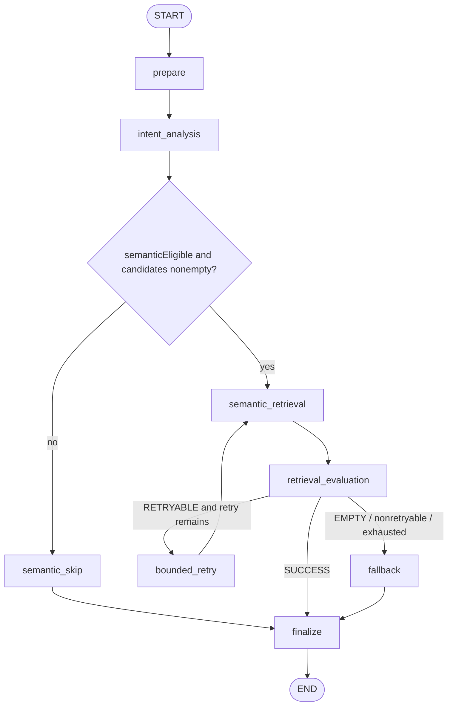

# 프로젝트 학습 5 — LangGraph recommendation workflow

## 무엇이며 어디에 있는가

LangGraph는 상태(state)를 입력으로 받아 node 함수를 실행하고 edge로 다음 node를 선택하는 workflow runtime이다. 이 프로젝트에서는 FastAPI 내부 `ai/app/workflows/recommendation_graph.py`에 있다. 외부 HTTP 계약과 Spring 책임을 바꾸지 않고 retrieval orchestration을 명시한다. 검색 알고리즘 자체나 restaurant ranker가 아니다.

## State

`recommendation_state.py::RecommendationWorkflowState`의 최소 정보:

- `originalQuery`, `candidateRestaurantIds`(tuple로 고정), `topK`
- `intent`, `semanticEligible`, `semanticQuery`
- `semanticResults`, `retrievalStatus`
- `retryCount`, `maxRetries`, `fallbackReason`, safe `errors`
- `workflowRoute`, node `trace`, start/elapsed timing, response

API key, 전체 Restaurant row, Qdrant 전체 payload, raw model response는 state에 넣지 않는다. Graph는 request를 복제하지 않고 주어진 candidate scope를 tuple로 유지한다. Retry에서도 query와 candidate list는 같다.

## Node와 전이

| Node | 입력에서 읽는 값 / 실행 | State 변화 | 다음 경로 |
|---|---|---|---|
| `prepare` | request query, candidate IDs, topK | ID를 tuple 고정, retry=0, trace/start time | intent |
| `intent_analysis` | originalQuery에 `analyze()` | intent, eligibility, 동일 query인 semanticQuery | UNKNOWN 또는 빈 scope면 skip, 아니면 retrieval |
| `semantic_skip` | eligibility/scope | EMPTY response, UNKNOWN_INTENT 또는 EMPTY_CANDIDATE_SCOPE | finalize |
| `semantic_retrieval` | query, immutable candidate tuple, intent, topK | 기존 `SemanticRetrievalService.retrieve` 호출; SUCCESS/EMPTY/typed failure 기록 | evaluation |
| `retrieval_evaluation` | retrievalStatus | trace 추가 | success→finalize; retryable+budget 남음→retry; 그 외→fallback |
| `bounded_retry` | retryCount/maxRetries | retryCount 1 증가, inputUnchanged trace | retrieval 재호출 |
| `fallback` | empty/nonretryable/exhausted 상태 | 빈 semantic response와 fallback route/reason | finalize |
| `finalize` | 현재 결과와 상태 | route, response, elapsed, safe log trace | END |

Node 구현의 일부는 nested closure다. Node 이름은 graph 등록명이고 함수 이름과 항상 동일하지는 않다(예: `evaluate_retrieval`가 `retrieval_evaluation` node로 등록됨).

## compile과 ainvoke

`build_recommendation_graph`가 `StateGraph(RecommendationWorkflowState)`에 node/edge를 등록하고 `compile()`한다. `main.py::recommendation_workflow`의 `@lru_cache(maxsize=1)`가 process에서 workflow 객체를 한 번 생성하도록 한다. 요청마다 새 graph를 만들지 않고 `RecommendationWorkflow.run()`에서 `await graph.ainvoke(initial_state)`로 비동기 실행한다. graph에 durable checkpoint store를 설정한 코드는 확인되지 않는다. 여기서 state는 실행 중 전달되는 자료구조이지, request 간 영속 대화기억이 아니다.

## 왜 if/else가 아니라 graph인가 — 그리고 비용

동일 동작은 Python 함수 안의 `if`/`try`/loop로도 구현 가능하다. Graph의 실질적 이점은 semantic skip, retry budget, fallback, trace 전이를 node/edge로 드러내고 각 path를 분리 테스트할 수 있다는 점이다. 여러 실행 분기나 지속적인 workflow 기능이 필요할수록 시각화/확장성이 유리하다.

이 V1은 node 8개와 최대 1회 retry뿐이다. LangGraph dependency, TypedDict state와 graph abstraction 때문에 단순 함수보다 읽을 층이 늘었다. durable checkpoint나 multi-agent collaboration을 사용하지 않으므로 “agent가 자율적으로 계획한다”거나 “대화 기억을 가진다”고 설명하면 과장이다. Graph를 넣었다는 이유로 모델 호출이나 새 기능이 생긴 것도 아니다.

## 사용자 질문 1건 walkthrough

`혼밥하기 좋은 곳` → Spring intent 계약 → Spring hard-filter IDs → FastAPI semantic-retrieval endpoint → `recommendation_workflow()`가 반환한 compiled graph → `ainvoke` → prepare → intent(DINING_CONTEXT) → retrieval → Ollama query embedding/Qdrant scoped query → retrieval evaluation → finalize → Spring sorting/dedup/max3. Failure는 앞 문서의 retry/fallback 표를 따른다. Graph의 HTTP response는 기존 `RetrievalResponse`이며 trace는 production response에 무조건 노출되지 않고 safe logger에 기록된다.

## Retry와 최종 contract

`semantic_runtime.py::_raise_retrieval_failure`가 실제 client exception을 typed dependency error로 바꾸고, graph가 오직 `RetryableDependencyUnavailable`에만 retry 기회를 준다. `MAX_RETRIES=1`은 최초 요청에 더해 추가 요청 하나를 뜻한다.

| 상황 | 분류/재시도 | 최종 FastAPI 응답 | Spring 관점 |
|---|---|---|---|
| timeout, socket/connection/일시 transport 오류 | retryable, 최대 1회 | 재시도 성공이면 200 candidates; 재실패면 sanitized 503 | fallback enabled면 signal 없는 Spring 후보로 deterministic 추천 |
| HTTP 500/502/503/504 | retryable, 최대 1회 | 위와 같음 | 위와 같음 |
| HTTP 429 | non-retryable, 0회 | graph fallback 후 endpoint가 503 | fallback 설정에 따라 기존 후보 유지 또는 오류 전파 |
| 기타 HTTP 4xx | non-retryable, 0회 | 503 (raw provider 내용은 노출하지 않음) | 동일 |
| malformed JSON/payload, invalid vector/dimension | validation/dependency error, non-retryable | 503 | 동일 |
| semantic result empty | 정상 EMPTY, 0회 | 200 + 빈 candidates | 후보는 Spring에 남고 semantic 신호 없음 |
| UNKNOWN/generic intent | semantic skip, embedding/Qdrant 0회 | 200 + 빈 candidates | deterministic 추천 계속 |
| candidate scope empty | graph direct call에서는 skip; Spring enricher는 빈 목록이면 HTTP를 생략 | 200 + 빈 candidates | 기존 empty 결과 또는 후보 없음 |

retry는 동일 query/candidate에서 일시 오류가 우연히 회복될 여지만 준다. 429는 quota/rate 정책이고, 4xx는 요청 계약 문제이며, malformed payload는 같은 요청을 반복해도 고쳐지지 않는다. Empty는 검색 결과라는 정상 상태라 동일 검색을 다시 해도 새로운 근거가 없다. 1회 상한은 장애 증폭·무한 loop·요청 지연을 제한한다. FastAPI graph가 retrieval 재시도의 단일 owner이며 Spring client는 재시도하지 않는다.

FastAPI 전체가 내려가도 `AI_SEMANTIC_RUNTIME_ENABLED=false`이면 Spring은 처음부터 internal call 없이 동작한다. ON이어도 `AI_FALLBACK_ENABLED=true`라면 intent 실패는 deterministic analyzer로, retrieval failure는 semantic signal 없는 hard-filtered list로 넘어갈 수 있다. `AI_FALLBACK_ENABLED=false`이면 실패가 SSE `error`로 끝날 수 있다. “항상 사용자 결과가 나온다”는 말은 fallback 설정이 켜진 경우에만 맞다.

### 내가 이해했는지 확인

- `candidateRestaurantIds`가 list에서 tuple로 바뀌는 시점은 언제인가?
- UNKNOWN은 graph의 어느 edge에서 retrieval을 피하는가?
- success, empty, transient error는 각각 어디로 가는가?
- compiled graph가 request마다 만들어지는가?
- State가 사용자 대화 history를 영속 보관하는가?
